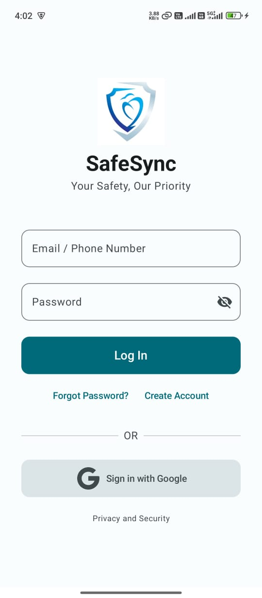
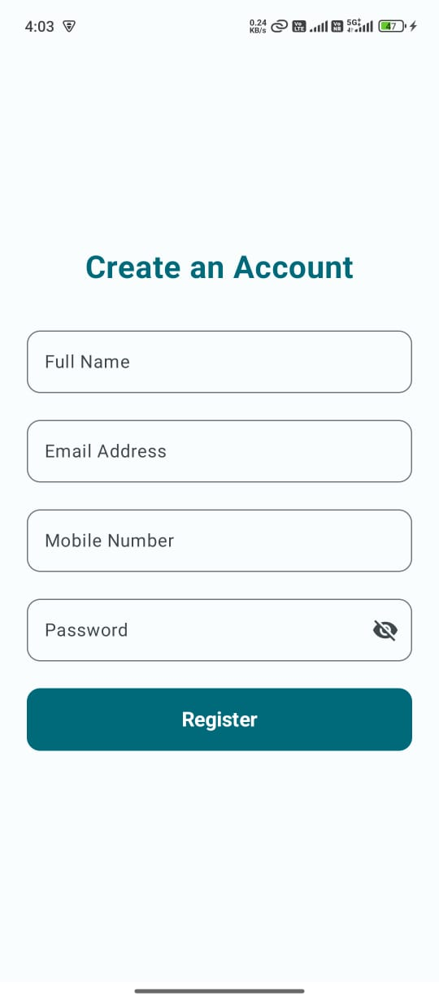
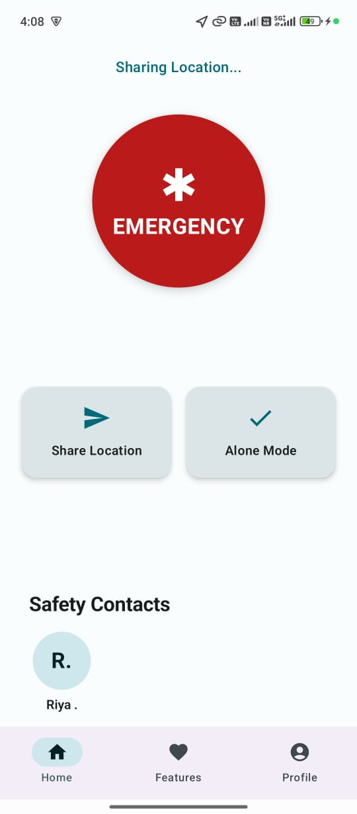
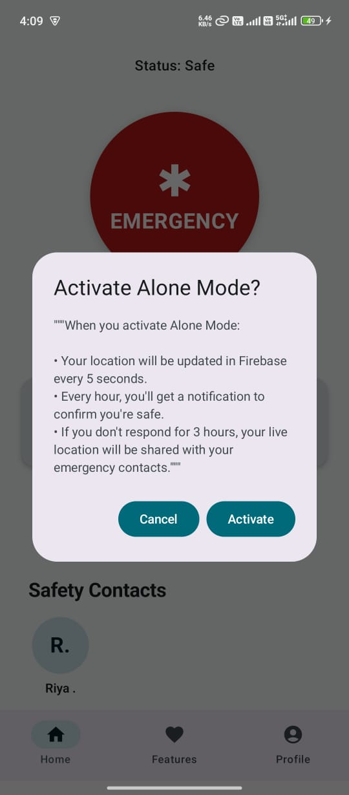
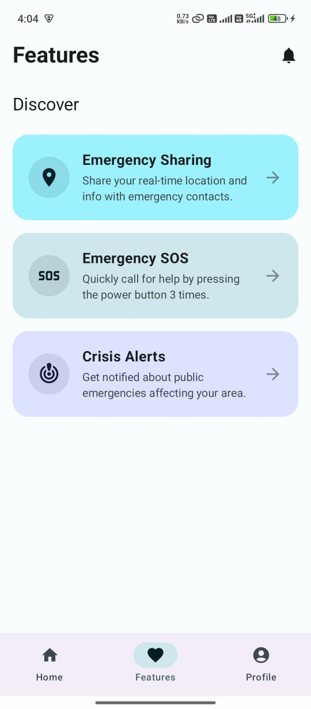
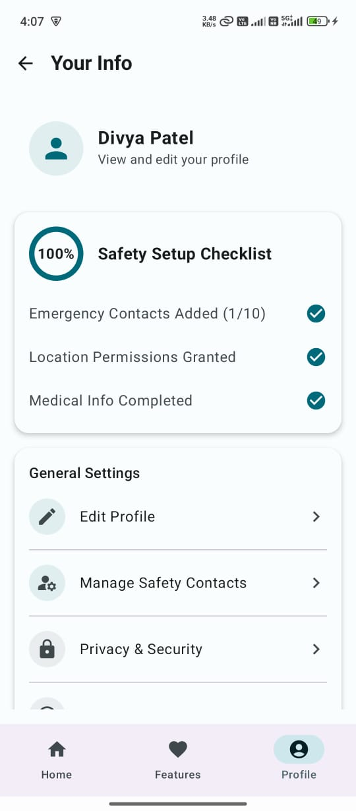

# Emergency SOS, Safety & Location Tracking App
# SafeSync

SafeSync is a personal safety Android application built with Kotlin and Jetpack Compose. It aims to provide peace of mind to users and their loved ones by offering a suite of safety features. In today's world, knowing that your friends and family are safe is more important than ever. SafeSync addresses this by providing a simple and effective way to stay connected and request help in case of an emergency.

## Features

*   **Real-time Location Sharing:** Allows users to share their live location with a pre-selected list of trusted contacts. The location is updated in real-time, providing an accurate view of the user's whereabouts. This is useful for letting family know you're on your way home, or for friends to find each other in a crowded place.

*   **Emergency SOS:** A prominent SOS button allows the user to immediately send an emergency alert to all their safety contacts. This alert includes a predefined message and a link to the user's current location on Google Maps, ensuring that help can be dispatched quickly and accurately.

*   **Contact Management:** A dedicated screen for managing safety contacts. Users can easily add new contacts from their phone's address book, or enter them manually. Existing contacts can be edited or removed. This ensures the user's emergency contact list is always up-to-date.

*   **User Profile & Authentication:** Secure user authentication using Firebase Authentication (Email/Password and Google Sign-In). Users can manage their profile information, including their name and phone number, ensuring their identity is correctly associated with their safety alerts.

*   **Material Design 3 & Jetpack Compose:** The entire UI is built using Jetpack Compose and follows the Material Design 3 guidelines, providing a modern, clean, and intuitive user experience that is consistent with the latest Android platform conventions.

*   **Firebase Integration:** Leverages the power of the Firebase suite. Firebase Authentication for user management, and Firebase Realtime Database to store user data, contacts, and location information in a synchronized, real-time manner.

*   **Google Play Services:** Integrates with Google Play Services for robust and battery-efficient location tracking and authentication.

## Key Features

*   **Material Design 3 & Jetpack Compose:** The entire UI is built using Jetpack Compose and follows the Material Design 3 guidelines, providing a modern, clean, and intuitive user experience that is consistent with the latest Android platform conventions.
*   **Real-time Location Sharing:** Share your live location with pre-selected emergency contacts. Location is updated in real-time, allowing your loved ones to know you're safe.
*   **Emergency SOS:** A powerful SOS feature that can be triggered by pressing the power button 3 times. It sends an emergency alert with your current location to all your safety contacts.
*   **Alone Mode:** An extra layer of security for when you're feeling unsafe. If you activate this mode and don't respond to safety check notifications, your location will be automatically shared with your contacts.
*   **Comprehensive Profile:** Maintain a detailed profile including your medical information (blood type, allergies, medications) which can be crucial for first responders in an emergency.
*   **Safety Setup Checklist:** An easy-to-follow checklist that guides you through setting up your emergency contacts, granting necessary permissions, and completing your medical info to ensure you are fully prepared.
*   **Crisis Alerts:** Get notified about public emergencies and crises happening in your area to stay informed and safe.
*   **Secure Authentication:** User accounts are secured with Firebase Authentication, supporting both email/password and Google Sign-In for easy and secure access.
*   **Privacy Focused:** A clear and transparent privacy policy outlining what data is collected and how itis used to provide the service, with a commitment to not selling your data.
*   **Firebase Integration:** Leverages the power of the Firebase suite. Firebase Authentication for user management, and Firebase Realtime Database to store user data, contacts, and location information in a synchronized, real-time manner.
*   **Google Play Services:** Integrates with Google Play Services for robust and battery-efficient location tracking and authentication.

## Screenshots
| Login Screen | Register Screen |
|---------------|----------------|
|  |  |
| Home Screen | Alone Mode |
|  |  |
| Feature Screen | Emergency SOS Screen |
|  |  |
| Profile Screen | Contact Screen |
|  |  |
| Edit Profile Screen | Medical Info Screen |
|  |  |
| Privacy & Safety Screen | Help & Support Screen |
|  |  |

SafeSync is built around a client-server architecture using Firebase as the backend.

*   **Frontend:** The Android app is built with modern Android development techniques. The UI is purely declarative, written in Jetpack Compose. The architecture follows the recommended guide, using ViewModels to separate logic from UI and to manage the UI state.

*   **Backend:** Firebase Authentication handles user sign-up and sign-in securely. Firebase Realtime Database is used to store all application data, such as user profiles, contact lists, and shared location data, which are synchronized in real-time across devices.
    SafeSync is built with a modern Android architecture using Firebase for its backend services.

*   **Location Services:** The app uses the Fused Location Provider API from Google Play Services to get the device's location efficiently and accurately, with minimal impact on battery life.
*   **Frontend:** The UI is built entirely with **Jetpack Compose**, providing a reactive and modern user interface. The app follows Google's recommended architecture, using **ViewModels** to manage UI state and interact with the backend.
*   **Backend:** **Firebase** is used for all backend needs. **Firebase Authentication** handles secure user login, while **Firebase Realtime Database** stores user data, contacts, and location information, ensuring all data is synchronized in real-time.
*   **Location Services:** The app utilizes the **Fused Location Provider API** from Google Play Services for efficient and accurate location tracking with minimal battery impact.

